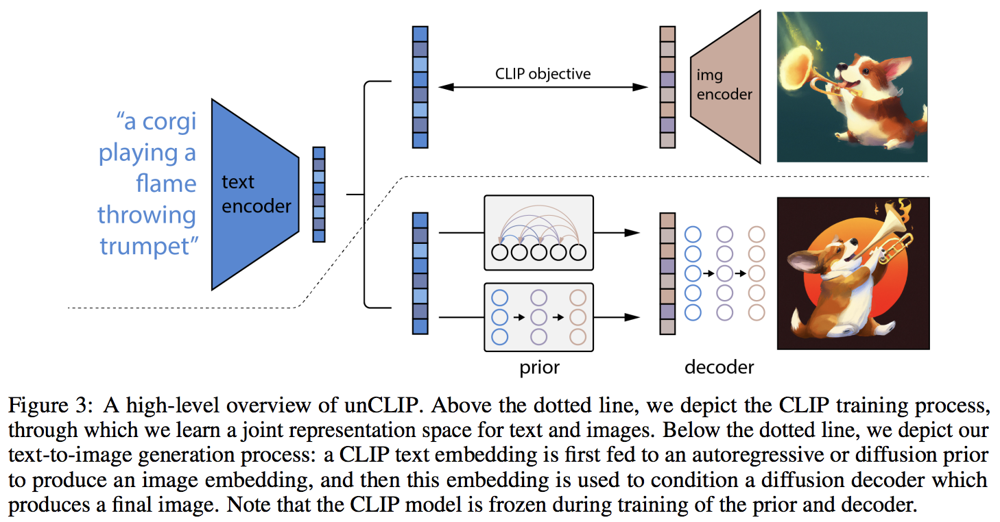

# 2025-01-Generation-Models
Generation model course at Hallym University 

이 저장소는 원 저자의 공개된 코드를 공부 목적으로 가져와 한글로 재정리한 것입니다. </br>
코드의 원 저작자는 아래에 명시하였으며, 본 저장소는 개인 학습 및 참고용으로 작성되었습니다.

출처 
- Model <a href="https://github.com/lucidrains/DALLE2-pytorch">DALLE 2-pytorch 구조</a>
- Weight & Example code <a href="https://github.com/LAION-AI/dalle2-laion">DALLE 2-LION </a>

---

</img>

## DALL-E 2 - Pytorch
PyTorch로 구현된 <a href="https://openai.com/dall-e-2/">DALL·E 2</a>, OpenAI의 최신 텍스트-이미지 생성 신경망입니다. 

<a href="https://youtu.be/RJwPN4qNi_Y?t=555">Yannic Kilcher 요약 영상</a> | <a href="https://www.youtube.com/watch?v=F1X4fHzF4mQ">AssemblyAI 설명 영상</a>

이 모델의 main novelty는 Prior 네트워크라는 중간 레이어를 추가한 점으로, 이 네트워크는 텍스트 임베딩(CLIP에서 생성됨)을 기반으로 이미지 임베딩을 예측합니다. Prior는 Autoregressive 트랜스포머 또는 Diffusion 기반 네트워크 중 하나일 수 있으며, 이 구현에서는 성능이 가장 뛰어난 diffusion prior 네트워크만 구현합니다. 
(재미있게도 이 diffusion prior는 Causal transformer 를 노이즈 제거 네트워크로 사용합니다 😂)

## Pre-Trained Models
- LAION은 현재 Prior 모델을 학습 중이며, 학습된 체크포인트는 <a href="https://huggingface.co/zenglishuci/conditioned-prior">🤗HuggingFace</a>에서 확인할 수 있고, 훈련 통계는 <a href="https://wandb.ai/nousr_laion/conditioned-prior/reports/LAION-DALLE2-PyTorch-Prior--VmlldzoyMDI2OTIx">🐝Weights & Biases(WANDB)</a>에서 확인할 수 있습니다.

- Decoder - <a href="https://wandb.ai/veldrovive/dalle2_train_decoder/runs/jkrtg0so?workspace=user-veldrovive">In-progress test run</a> 🚧
- Decoder - <a href="https://wandb.ai/veldrovive/dalle2_train_decoder/runs/3d5rytsa?workspace=">Another test run with sparse attention</a>
- DALL-E 2 🚧 - <a href="https://github.com/LAION-AI/dalle2-laion">DALL-E 2 Laion repository</a>

- 사용한 예제는 DALL-E 2에서 공개된 모델을 사용하였습니다.
<a href="https://github.com/LAION-AI/dalle2-laion">DALL-E 2 Laion repository</a>

## DALLE2-LION
다음은 LAION에서 사전 학습한 DALLE-2 모델을 위한 자료 및 도구 모음입니다.</br>
공식 코드베이스는
<a href="https://github.com/lucidrains/DALLE2-pytorch">DALLE2-PyTorch</a>
에서 확인할 수 있습니다.

예제 코드는 notebooks 내 dalle2_laion_alpha.ipynb 파일로 실행가능합니다. 

### Install 
예제 코드 실행이 안된다면, 다음과 같이 환경설정을 수행하시면 됩니다. 

conda create -n dalle2

git clone https://github.com/LAION-AI/dalle2-laion.git
cd dalle2-laion
pip install -e . 

error가 발생한다면, 
setup.py 파일 내 

setup(
    name = "dalle2-laion",
    version = "0.0.1",
    packages = find_packages(exclude=[]),
    include_package_data = True,
    install_requires = [
        "packaging>=21.0",
        "pydantic>=1.9.0",
        "torch>=1.10",
        "Pillow>=9.0.0",
        "numpy>=1.20.0",
        "click>=8.0.0",
        "dalle2-pytorch"
    ]
)

수정해주세요 

## Citations

```bibtex
@misc{ramesh2022,
    title   = {Hierarchical Text-Conditional Image Generation with CLIP Latents}, 
    author  = {Aditya Ramesh et al},
    year    = {2022}
}
```

```bibtex
@misc{crowson2022,
    author  = {Katherine Crowson},
    url     = {https://twitter.com/rivershavewings}
}
```

```bibtex
@misc{rombach2021highresolution,
    title   = {High-Resolution Image Synthesis with Latent Diffusion Models}, 
    author  = {Robin Rombach and Andreas Blattmann and Dominik Lorenz and Patrick Esser and Björn Ommer},
    year    = {2021},
    eprint  = {2112.10752},
    archivePrefix = {arXiv},
    primaryClass = {cs.CV}
}
```

```bibtex
@article{shen2019efficient,
    author  = {Zhuoran Shen and Mingyuan Zhang and Haiyu Zhao and Shuai Yi and Hongsheng Li},
    title   = {Efficient Attention: Attention with Linear Complexities},
    journal = {CoRR},
    year    = {2018},
    url     = {http://arxiv.org/abs/1812.01243},
}
```

```bibtex
@article{Yu2021VectorquantizedIM,
    title   = {Vector-quantized Image Modeling with Improved VQGAN},
    author  = {Jiahui Yu and Xin Li and Jing Yu Koh and Han Zhang and Ruoming Pang and James Qin and Alexander Ku and Yuanzhong Xu and Jason Baldridge and Yonghui Wu},
    journal = {ArXiv},
    year    = {2021},
    volume  = {abs/2110.04627}
}
```

```bibtex
@article{Shleifer2021NormFormerIT,
    title   = {NormFormer: Improved Transformer Pretraining with Extra Normalization},
    author  = {Sam Shleifer and Jason Weston and Myle Ott},
    journal = {ArXiv},
    year    = {2021},
    volume  = {abs/2110.09456}
}
```

```bibtex
@article{Yu2022CoCaCC,
    title   = {CoCa: Contrastive Captioners are Image-Text Foundation Models},
    author  = {Jiahui Yu and Zirui Wang and Vijay Vasudevan and Legg Yeung and Mojtaba Seyedhosseini and Yonghui Wu},
    journal = {ArXiv},
    year    = {2022},
    volume  = {abs/2205.01917}
}
```

```bibtex
@misc{wang2021crossformer,
    title   = {CrossFormer: A Versatile Vision Transformer Hinging on Cross-scale Attention},
    author  = {Wenxiao Wang and Lu Yao and Long Chen and Binbin Lin and Deng Cai and Xiaofei He and Wei Liu},
    year    = {2021},
    eprint  = {2108.00154},
    archivePrefix = {arXiv},
    primaryClass = {cs.CV}
}
```

```bibtex
@article{ho2021cascaded,
    title   = {Cascaded Diffusion Models for High Fidelity Image Generation},
    author  = {Ho, Jonathan and Saharia, Chitwan and Chan, William and Fleet, David J and Norouzi, Mohammad and Salimans, Tim},
    journal = {arXiv preprint arXiv:2106.15282},
    year    = {2021}
}
```

```bibtex
@misc{Saharia2022,
    title   = {Imagen: unprecedented photorealism × deep level of language understanding},
    author  = {Chitwan Saharia*, William Chan*, Saurabh Saxena†, Lala Li†, Jay Whang†, Emily Denton, Seyed Kamyar Seyed Ghasemipour, Burcu Karagol Ayan, S. Sara Mahdavi, Rapha Gontijo Lopes, Tim Salimans, Jonathan Ho†, David Fleet†, Mohammad Norouzi*},
    year    = {2022}
}
```

```bibtex
@article{Choi2022PerceptionPT,
    title   = {Perception Prioritized Training of Diffusion Models},
    author  = {Jooyoung Choi and Jungbeom Lee and Chaehun Shin and Sungwon Kim and Hyunwoo J. Kim and Sung-Hoon Yoon},
    journal = {ArXiv},
    year    = {2022},
    volume  = {abs/2204.00227}
}
```

```bibtex
@article{Saharia2021PaletteID,
    title   = {Palette: Image-to-Image Diffusion Models},
    author  = {Chitwan Saharia and William Chan and Huiwen Chang and Chris A. Lee and Jonathan Ho and Tim Salimans and David J. Fleet and Mohammad Norouzi},
    journal = {ArXiv},
    year    = {2021},
    volume  = {abs/2111.05826}
}
```

```bibtex
@article{Lugmayr2022RePaintIU,
    title   = {RePaint: Inpainting using Denoising Diffusion Probabilistic Models},
    author  = {Andreas Lugmayr and Martin Danelljan and Andr{\'e}s Romero and Fisher Yu and Radu Timofte and Luc Van Gool},
    journal = {ArXiv},
    year    = {2022},
    volume  = {abs/2201.09865}
}
```

```bibtex
@misc{chen2022analog,
    title   = {Analog Bits: Generating Discrete Data using Diffusion Models with Self-Conditioning},
    author  = {Ting Chen and Ruixiang Zhang and Geoffrey Hinton},
    year    = {2022},
    eprint  = {2208.04202},
    archivePrefix = {arXiv},
    primaryClass = {cs.CV}
}
```

```bibtex
@article{Qiao2019WeightS,
    title   = {Weight Standardization},
    author  = {Siyuan Qiao and Huiyu Wang and Chenxi Liu and Wei Shen and Alan Loddon Yuille},
    journal = {ArXiv},
    year    = {2019},
    volume  = {abs/1903.10520}
}
```

```bibtex
@inproceedings{rogozhnikov2022einops,
    title   = {Einops: Clear and Reliable Tensor Manipulations with Einstein-like Notation},
    author  = {Alex Rogozhnikov},
    booktitle = {International Conference on Learning Representations},
    year    = {2022},
    url     = {https://openreview.net/forum?id=oapKSVM2bcj}
}
```

```bibtex
@article{Sunkara2022NoMS,
    title   = {No More Strided Convolutions or Pooling: A New CNN Building Block for Low-Resolution Images and Small Objects},
    author  = {Raja Sunkara and Tie Luo},
    journal = {ArXiv},
    year    = {2022},
    volume  = {abs/2208.03641}
}
```

```bibtex
@article{Salimans2022ProgressiveDF,
    title   = {Progressive Distillation for Fast Sampling of Diffusion Models},
    author  = {Tim Salimans and Jonathan Ho},
    journal = {ArXiv},
    year    = {2022},
    volume  = {abs/2202.00512}
}
```

*Creating noise from data is easy; creating data from noise is generative modeling.* - <a href="https://arxiv.org/abs/2011.13456">Yang Song's paper</a>
